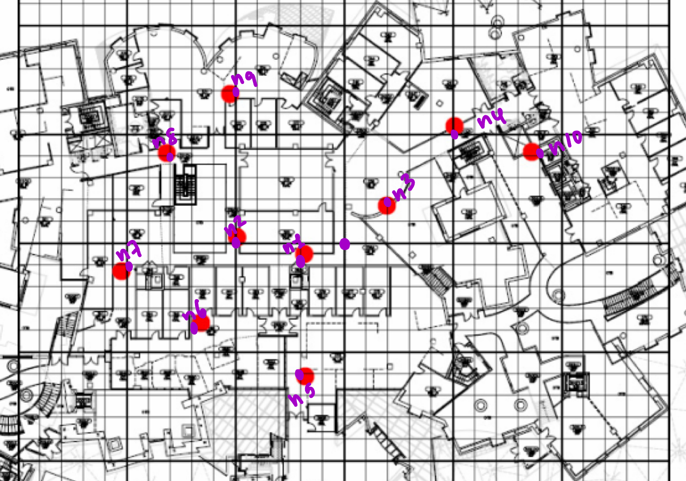

# Topologies

This directory contains the COPE testbed topology and NYC Mesh network topology, in the format accepted by our network simulation.

## NYCMesh Data

We generated our NYCMesh map using data pulled from the NYCMesh website. 

Data in this directory pulled from [this github](https://github.com/nycmeshnet/network-map/tree/master/src/data), updated as of December 13, 2023. We then parsed this data into our format, the code for which can be found in [`./nyc_mesh_parse.py`](./nyc_mesh_parse.py).

## COPE Testbed Data

To generate the COPE testbed data, we projected a grid onto the diagram from the paper and approximated node locations within Stata. The projection can be found below.

